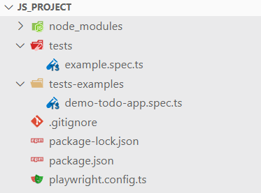
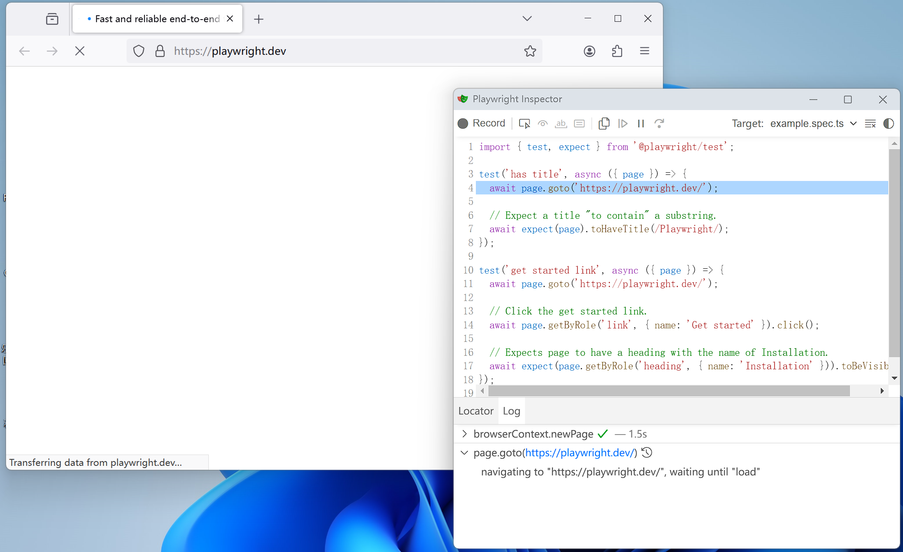
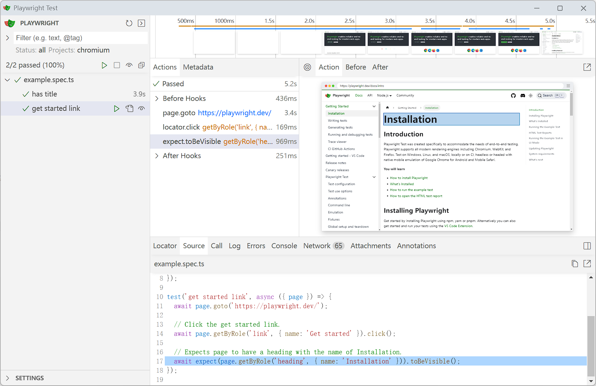
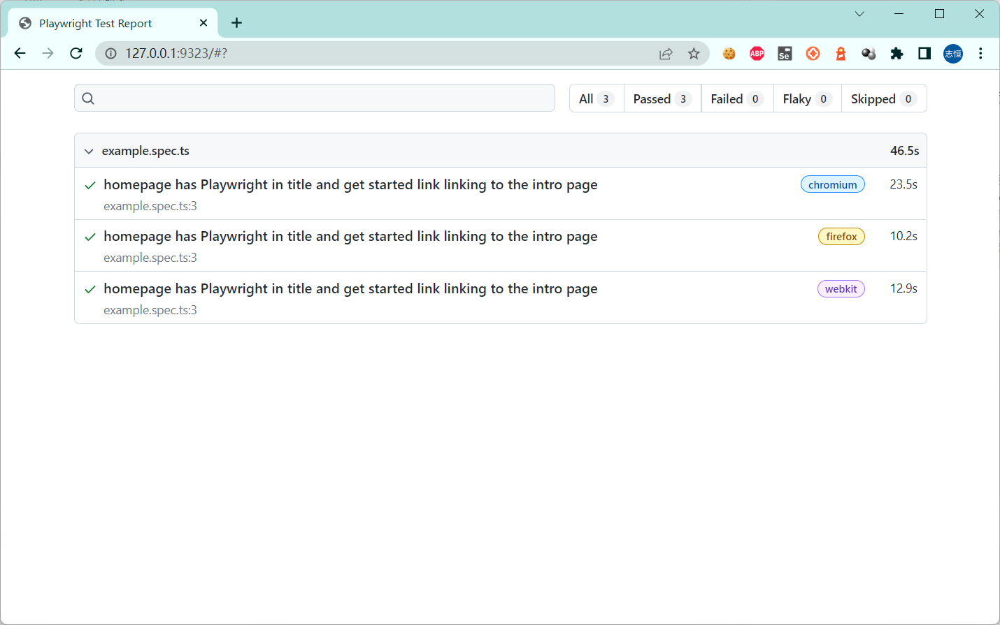

# plywright（Node.js版）

playwright 支持多种语言：

* node.js: https://github.com/microsoft/playwright
* Python: https://github.com/microsoft/playwright-python
* .NET: https://github.com/microsoft/playwright-dotnet
* Java: https://github.com/microsoft/playwright-java


## 安装

- [x] node.js

* 下载地址

https://nodejs.org/en/download/

* 查看版本

```shell
> node --version
v18.20.3

> npm --version
10.7.0
```

- [x] playwright

* 初始化项目

```shell
> npm init playwright@latest

Need to install the following packages:
create-playwright@1.17.133
Ok to proceed? (y) y


> npx
> create-playwright

Getting started with writing end-to-end tests with Playwright:
Initializing project in '.'
√ Do you want to use TypeScript or JavaScript? · TypeScript
√ Where to put your end-to-end tests? · tests
√ Add a GitHub Actions workflow? (y/N) · false
√ Install Playwright browsers (can be done manually via 'npx playwright install')? (Y/n) · true
Initializing NPM project (npm init -y)…
Wrote to D:\github\AutoTestClass\Learn-playwright-class\demo\package.json:

{
  "name": "demo",
  "version": "1.0.0",
  "main": "index.js",
  "scripts": {
    "test": "echo \"Error: no test specified\" && exit 1"
  },
  "keywords": [],
  "author": "",
  "license": "ISC",
  "description": ""
}


Installing Playwright Test (npm install --save-dev @playwright/test)…

added 3 packages in 5s
Installing Types (npm install --save-dev @types/node)…

added 2 packages in 2s
Writing playwright.config.ts.
Writing tests\example.spec.ts.
Writing tests-examples\demo-todo-app.spec.ts.
Writing package.json.
Downloading browsers (npx playwright install)…
Downloading Firefox 128.0 (playwright build v1458) from https://playwright.azureedge.net/builds/firefox/1458/firefox-win64.zip
83.8 MiB [====================] 100% 0.0s
Firefox 128.0 (playwright build v1458) downloaded to C:\Users\fnngj\AppData\Local\ms-playwright\firefox-1458
Downloading Webkit 18.0 (playwright build v2051) from https://playwright.azureedge.net/builds/webkit/2051/webkit-win64.zip
45.9 MiB [====================] 100% 0.0s
Webkit 18.0 (playwright build v2051) downloaded to C:\Users\fnngj\AppData\Local\ms-playwright\webkit-2051
✔ Success! Created a Playwright Test project at D:\github\AutoTestClass\Learn-playwright-class\project
..
```

## 测试用例

* 目录结构：



`tests`文件夹包含一个基本的示例测试，可以帮助您开始测试。

`test-sample`文件夹更详细的示例，包含为测试todo应用程序而编写的测试。


* 简单的例子

```ts
// 导入playwright测试
import { test, expect } from '@playwright/test';

test('has title', async ({ page }) => {
  await page.goto('https://playwright.dev/');

  // 期望标题“包含”子字符串
  await expect(page).toHaveTitle(/Playwright/);
});

test('get started link', async ({ page }) => {
  await page.goto('https://playwright.dev/');

  // 点击“get started”链接
  await page.getByRole('link', { name: 'Get started' }).click();

  //  检查页面是否有一个标题“安装”
  await expect(page.getByRole('heading', { name: 'Installation' })).toBeVisible();
});
```

## 运行测试

进入项目`project\`目录，通过下面的命令运行测试。

* 运行命令

```shell
$ npx playwright test  # 运行 e2e测试
$ npx playwright test --ui     # 启动交互式UI模式
$ npx playwright test --project=chromium   # 运行在桌面Chromium上的测试
$ npx playwright test example      # 运行指定文件的测试
$ npx playwright test --debug      # 运行在调试模式下
$ npx playwright codegen      # 自动生成测试代码
```

---
* 默认`--headless`模式运行

```shell
$ npx playwright test

Running 6 tests using 6 workers
...
```
> /tests/example.spec.ts 里面两条用例三个浏览器分别运行，所以，运行6条测试。

---

* 指定`--headed`模式运行

```shell
$ npx playwright test --headed

Running 6 tests using 6 workers
...
```
> headed模式运行。

---
* 指定浏览器

```shell
$ npx playwright test --project=chromium
$ npx playwright test --project=chromium --project=firefox
```
> * 指定 chromium 浏览器。
> * 指定 chromium 和 firefox 浏览器。

---
* 指定目录&文件

```shell
$ npx playwright test tests
$ npx playwright test example.spec.ts 
$ npx playwright test example bing
$ npx playwright test -g "has title"
```
> * 指定 tests 目录运行， 
> * 指定 example.spec.ts 文件名 前面不能根目录。
> * 模糊 匹配 example  和 bing 文件名。
> * 指定特定标题 "has title" 的用例

---
* 运行最近失败的用例


```shell
$ npx playwright test --last-failed
```
> 要只运行上次测试中失败的测试，首先运行你的测试，然后再使用 --last-failed 标志重新运行它们。

* 指定`--debug`模式运行

```shell
$ npx playwright test --debug
$ npx playwright test example.spec.ts --debug
$ npx playwright test example.spec.ts:10 --debug
```
> 启动 plywright Inspector 工具
> * 默认调试所有用例。
> * 指定测试文件调试。
> * 从test(..)所在的行号调试特定的测试。在测试文件名的末尾添加一个冒号，后跟行号，后跟——debug标志。



---

* UI模式运行

```shell
$ npx playwright test
```




---
* 查看报告

```shll
$ npx playwright show-report

Serving HTML report at http://127.0.0.1:9323. Press Ctrl+C to quit.
```

浏览器访问URL: http://127.0.0.1:9323




## 编写基本测试

Playwright测试是简单的，一个完整的测试它包含以下部分：
 
- **导航**
- **元素定位**
- **执行动作**
- **断言状态**

一个简单的示例：

```typescript
import { test, expect } from '@playwright/test';

test('get started link', async ({ page }) => {
  await page.goto('https://playwright.dev/');

  // 点击“Get started”链接。
  await page.getByRole('link', { name: 'Get started' }).click();

  // 期望页面有一个名为“Installation”的标题。
  await expect(page.getByRole('heading', { name: 'Installation' })).toBeVisible();
});
```

> * 在执行动作之前，不需要等待任何东西：Playwright 在执行每个动作之前会自动等待通过广泛的可操作性检查。
> * 在执行检查时也无需处理竞态条件 - Playwright 断言被设计成一种方式，即它们描述了需要最终满足的期望。
> 就是这样！这些设计选择允许 Playwright 用户完全忘记在测试中的不稳定的超时和种族检查。


**你将学到**

- 如何编写定位
- 如何执行动作
- 如何使用断言

### 定位


#### **`page.locator()`**

- 这是 Playwright 中最灵活且常用的元素定位方法。它接受一个 CSS 选择器、XPath 表达式、文本内容等作为参数，用于定位页面上的元素。`page.locator()` 返回的是一个 `Locator` 对象，你可以在该对象上调用各种方法来对元素进行操作，如点击、输入文本等。

> 我们建议优先考虑 用户可见的定位器（如文本或可访问角色），而不是使用与实现相关且可能在页面更改时中断的 CSS。

__CSS 选择器__

Playwright 添加了自定义伪类，如 `:visible`、`:has-text()`、`:has()`、`:is()`、`:nth-match()` 等。

* HTML页面

```html
<button style='display: none'>Invisible</button>
<button>Visible</button>

<article> learn Playwright</article>

<article>
   <div class="promo">

<button>Log in</button>

<div id="nav-bar">
  <span>Home</span>
  <span>Learn</span>
</div>

<button>Login</button>
<button>log IN</button>
```

* 定位方法
  
```js
// 匹配页面上的所有<button></button>
await page.locator('css=button')

// 这将找到两个按钮并抛出 strictness 违规错误：
await page.locator('button')

// 这只会找到第二个按钮，因为它是可见的
await page.locator('button:visible')

// 错误，将匹配许多元素，包括<body>
await page.locator(':has-text("Playwright")').click();

// 这将找到 article 元素，因为它包含文本“Playwright”
await page.locator('article:has-text("Playwright")')

// 这将找到 article 元素，因为它包含 div.promo 元素
await page.locator('article:has(div.promo)')

// 符合条件之一的元素
await page.locator('button:has-text("Log in"), button:has-text("Sign in")')

// 这将在 #nav-bar 元素内的某处找到带有文本 "Home" 的元素
await page.locator('#nav-bar :text("Home")')
// 精确匹配区分大小写、修剪空格并搜索完整字符串。
await page.locator('#nav-bar :text-is("Home")') 

await page.locator('#nav-bar :text-is("Home")') 

// 类似 JavaScript 的正则表达式 匹配的最小元素。
await page.locator('button :text-matches("Log\s*in", "i")') 
```

__CSS：还可以根据布局匹配元素。__

```js
// 匹配文本为 Password 右侧<input></input>
await page.locator('input:right-of(:text("Password"))')

// 匹配id="promo-card" 附近的<button></button>
await page.locator('button:near(.promo-card)')
```

* `:right-of(div > button)` - 匹配与内部选择器匹配的任何元素右侧的元素，在任何垂直位置。

* `:left-of(div > button)` - 匹配位于任何垂直位置的与内部选择器匹配的任何元素左侧的元素。

* `:above(div > button)` - 匹配任何水平位置上与内部选择器匹配的任何元素之上的元素。

* `:below(div > button)` - 匹配任何水平位置上与内部选择器匹配的任何元素下方的元素。

* `:near(div > button)` - 匹配与内部选择器匹配的任何元素附近（50 CSS 像素内）的元素。

__CSS:从查询结果中选择第 n 个匹配项__

* HTML页面

```html
<section> <button>Buy</button> </section>
<article><div> <button>Buy</button> </div></article>
<div><div> <button>Buy</button> </div></div>
```

* 定位方法

```js
// 择上面代码片段中的第三个按钮。请注意，索引是基于 1 的
await page.locator(':nth-match(:text("Buy"), 3)')

//  nth= 定位器将查询范围缩小到第 n 个匹配项, 
await page.locator('button').locator('nth=0')  // 获取第一个元素
await page.locator('button').locator('nth=-1') // 获取最后一个元素
```

__Xpath定位__

```js
await page.locator('xpath=//button')
```

任何以 `//` 或 `..` 开头的选择器字符串都被假定为 xpath 选择器。

```js
await page.locator('//button')
```

比较复杂的一个xpath定位

```js
await page.locator(
    `//span[contains(@class, 'spinner__loading')]|//div[@id='confirmation']`
)
```


#### **`page.getByRole()`**

- 这个方法基于 ARIA 角色来定位元素。它对于可访问性测试特别有用，允许你根据元素的 ARIA 角色来查找元素，而不是依赖于其 CSS 类名或 ID。这对于动态生成的元素或当元素的 ID 或类名频繁变化时特别有用。

* 定位用法

```js
await page.getByRole('heading', { name: 'Sign up' })

await page.getByRole('checkbox', { name: 'Subscribe' })

await page.getByRole('button', { name: /submit/i })
```
> { name: /submit/i } 指定了一个属性过滤器，它要求被定位的元素必须有一个“name”属性，且该属性的值包含“submit”（不区分大小写，因为使用了正则表达式/submit/i，其中i表示不区分大小写的搜索）。

下面是一个包含Playwright中`page.getByRole()`方法支持的ARIA角色及其简要说明的表格。请注意，这个列表是基于ARIA规范中的角色，并且Playwright通过`getByRole`方法支持这些角色来定位页面上的元素。


| 角色               | 说明                                                                                                             |
| ------------------ | ---------------------------------------------------------------------------------------------------------------- |
| `alert`            | 表示一个警告、错误或重要信息，这些信息需要用户立即注意，但不需要用户进行任何操作。                               |
| `alertdialog`      | 表示一个对话框，它包含了一个或多个警告、错误或重要信息，这些信息需要用户立即注意，并且可能需要用户进行某些操作。 |
| `application`      | 表示一个独立的、可嵌入的、可重用的UI组件，它可能包含自己的文档结构。                                             |
| `article`          | 表示文档、页面或应用程序中独立的内容或容器，其内容与文档的其他部分在内容或目的上有所不同。                       |
| `banner`           | 表示页面的主要标题或介绍性内容。                                                                                 |
| `blockquote`       | 表示一段长引用。                                                                                                 |
| `button`           | 表示一个可点击的按钮。                                                                                           |
| `caption`          | 表示表格的标题或说明。                                                                                           |
| `cell`             | 表示表格中的一个单元格。                                                                                         |
| `checkbox`         | 表示一个复选框，用户可以通过它来选择多个选项中的一个或多个。                                                     |
| `code`             | 表示计算机代码或脚本。                                                                                           |
| `columnheader`     | 表示表格中一列的标题。                                                                                           |
| `combobox`         | 表示一个组合框，它允许用户从下拉列表中选择一个值，或者输入一个新的值。                                           |
| `complementary`    | 表示与页面主要内容互补的内容，但移除这些内容也不会影响页面的主要功能。                                           |
| `contentinfo`      | 表示页面的版权信息、隐私政策等法律或管理信息。                                                                   |
| `definition`       | 表示术语的定义。                                                                                                 |
| `deletion`         | 表示文档中被删除的内容。                                                                                         |
| `dialog`           | 表示一个对话框或窗口，它要求用户进行交互，以完成某个任务或提供信息。                                             |
| `directory`        | 表示一个目录列表。                                                                                               |
| `document`         | 表示一个文档或页面。                                                                                             |
| `emphasis`         | 表示强调的文本。                                                                                                 |
| `feed`             | 表示一个Web提要，如RSS或Atom提要。                                                                               |
| `figure`           | 表示一个自包含的单元，如插图、图表、照片、代码等，这些单元可能包含标题（caption）。                              |
| `form`             | 表示一个表单，用于收集用户输入。                                                                                 |
| `generic`          | 一个通用的、未明确分类的角色。                                                                                   |
| `grid`             | 表示一个网格，用于展示表格数据或布局元素。                                                                       |
| `gridcell`         | 表示网格中的一个单元格。                                                                                         |
| `group`            | 表示一组相关的元素，这些元素通常作为单个单元进行交互。                                                           |
| `heading`          | 表示一个标题，用于组织或导航页面内容。                                                                           |
| `img`              | 表示一个图像。                                                                                                   |
| `insertion`        | 表示文档中被插入的内容。                                                                                         |
| `link`             | 表示一个超链接。                                                                                                 |
| `list`             | 表示一个列表。                                                                                                   |
| `listbox`          | 表示一个列表框，用户可以从中选择一个或多个选项。                                                                 |
| `listitem`         | 表示列表中的一个项目。                                                                                           |
| `log`              | 表示日志或一系列的用户活动。                                                                                     |
| `main`             | 表示页面的主要内容。                                                                                             |
| `marquee`          | 表示一个滚动的文本或图像容器。                                                                                   |
| `math`             | 表示数学表达式。                                                                                                 |
| `meter`            | 表示一个标量测量或分数值（通常是一个范围内的值），如磁盘使用情况或测试分数。                                     |
| `menu`             | 表示一个菜单，它包含了一组用户可以选择的命令或选项。                                                             |
| `menubar`          | 表示一个菜单栏，它包含了一组菜单项，每个菜单项都打开了一个菜单。                                                 |
| `menuitem`         | 表示一个菜单项，用户可以选择它来执行一个命令。                                                                   |
| `menuitemcheckbox` | 表示一个复选框菜单项，用户可以通过它来选择多个选项中的一个或多个。                                               |
| `menuitemradio`    | 表示一个单选按钮菜单项，用户可以从一组互斥的选项中选择一个。                                                     |
| `navigation`       | 表示页面上的导航部分。                                                                                           |
| `none`             | 表示没有角色。                                                                                                   |
| `note`             | 表示一个注释或注解，它提供了关于另一个元素的额外信息。                                                           |
| `option`           | 表示一个选项，它是从一组选项中选择的一个元素（如在`<select>`元素中）。                                           |
| `paragraph`        | 表示一个段落。                                                                                                   |
| `presentation`     | 表示一个元素，它仅用于呈现，不应被辅助技术识别或读取。                                                           |
| `progressbar`      | 表示一个进度条，用于显示任务的进度。                                                                             |
| `radio`            | 表示一个单选按钮，用户可以从一组互斥的选项中选择一个。                                                           |
| `radiogroup`       | 表示一组单选按钮，这些按钮共享相同的名称属性，因此它们是互斥的。                                                 |
| `region`           | 表示页面上的一个区域，它包含了一组相关的内容或功能。                                                             |
| `row`              | 表示表格中的一行。                                                                                               |
| `rowgroup`         | 表示表格中的一组行，这些行通常具有相同的属性或样式。                                                             |
| `rowheader`        | 表示表格中一行的标题。                                                                                           |
| `scrollbar`        | 表示一个滚动条。                                                                                                 |
| `search`           | 表示一个搜索框或搜索工具。                                                                                       |
| `searchbox`        | 表示一个搜索框，用户可以在其中输入搜索查询。                                                                     |
| `separator`        | 表示一个分隔符，用于将内容或控件分组。                                                                           |
| `slider`           | 表示一个滑块控件，用户可以通过拖动滑块来选择一个值。                                                             |
| `spinbutton`       | 表示一个旋转按钮控件，用户可以通过点击来增加或减少一个值。                                                       |
| `status`           | 表示一个状态栏，它提供了关于用户代理（如浏览器）的默认状态信息。                                                 |
| `strong`           | 表示强调的文本，其重要性高于`emphasis`。                                                                         |
| `subscript`        | 表示下标文本。                                                                                                   |
| `superscript`      | 表示上标文本。                                                                                                   |
| `switch`           | 表示一个开关控件，用户可以在两种状态之间切换（如开/关）。                                                        |
| `tab`              | 表示一个选项卡，它是选项卡面板中的一个可选项。                                                                   |
| `table`            | 表示一个表格。                                                                                                   |
| `tablist`          | 表示一个选项卡列表，它包含了一组选项卡。                                                                         |
| `tabpanel`         | 表示一个选项卡面板，它是与选项卡列表相关联的内容区域。                                                           |
| `term`             | 表示术语的定义项。                                                                                               |
| `textbox`          | 表示一个文本输入框，用户可以在其中输入文本。                                                                     |
| `time`             | 表示日期、时间或两者。                                                                                           |
| `timer`            | 表示一个计时器，它显示经过的时间或倒计时。                                                                       |
| `toolbar`          | 表示一组工具按钮，这些按钮通常与页面上的某个特定功能相关联。                                                     |
| `tooltip`          | 表示一个工具提示，它提供了关于另一个元素的额外信息。                                                             |
| `tree`             | 表示一个树形控件，用于展示具有层次结构的数据。                                                                   |
| `treegrid`         | 表示一个树形网格控件，它结合了树形控件和网格控件的特性。                                                         |
| `treeitem`         | 表示树形控件或树形网格控件中的一个项目。                                                                         |

请注意，这个列表可能不是完全详尽的，因为ARIA规范可能会随着时间的推移而更新。此外，Playwright的实现可能会根据具体的版本和更新而有所不同。

#### **`page.getByLabel()`**
- 大多数表单控件通常都有专用标签，可以方便地用于与表单交互。在这种情况下，你可以使用 `page.getByLabel()` 通过其关联标签来定位该控件。

* HTML页面

```html
<label>Password <input type="password" /></label>
```

* 定位用法

```js
await page.getByLabel('Password')
```

####** `page.getByPlaceholder()`**

- 根据输入框的 placeholder 属性来定位元素。这对于那些具有占位符文本（提示用户输入内容的文本）的输入框特别有用。

* HTML页面

```html
<input type="email" placeholder="name@example.com" />
```

* 定位用法

```js
await page.getByPlaceholder('name@example.com')
```

#### **`page.getByText()`**

- 根据元素的可见文本内容来定位元素。这对于定位包含特定文本的按钮、链接等非常有用。

* HTML页面

```html
<span>Welcome, John</span>
```

* 定位用法

```js
// 通过元素包含的文本来定位该元素
await expect(page.getByText('Welcome, John'))

// 设置精确匹配：
await expect(page.getByText('Welcome, John', { exact: true }))

// 与正则表达式匹配
await expect(page.getByText(/welcome, [A-Za-z]+$/i))
```

#### **`page.getByAltText()`**

- 根据图片的 `alt` 文本属性来定位图片元素。这对于确保图片具有适当的替代文本以提高可访问性特别有用。


* HTML页面

```html

```

* 定位用法

```js
await page.getByAltText('playwright logo')
```

#### **`page.getByTitle()`**
   - 根据元素的 `title` 属性来定位元素。尽管这不太常见，但在某些情况下，根据元素的 `title` 文本来定位元素可能是必要的。


* HTML页面

```html
<span title='Issues count'>25 issues</span>
```

* 定位用法

```js
await page.getByTitle('Issues count')
```

#### **`page.getByTestId()`**

- 通过自定义的 `data-testid` 属性来定位元素。这种方法要求你在开发时就在元素上添加了 `data-testid` 属性，以便于测试脚本能够轻松定位到这些元素。

* HTML页面
```html
<button data-testid="directions">Itinéraire</button>
```

* 定位用法

```js
await page.getByTestId('directions')
```

#### 更多

https://playwright.dev/docs/locators

https://playwright.dev/docs/other-locators


### 动作

**导航**

大多数测试将从导航页面到 URL 开始。之后，测试将能够与页面元素进行交互。

```typescript
await page.goto('https://playwright.dev/');
```

Playwright 将等待页面达到加载状态后才会继续。了解更多关于 page.goto() 选项。

**交互**

执行动作始于定位元素。Playwright 使用 Locators API 执行此操作。定位符表示在任何时候在页面上找到元素（s）的方式，了解更多关于可用的不同类型定位符。

```typescript
// 创建一个定位符。
const getStarted = page.getByRole('link', { name: 'Get started' });

// 点击它。
await getStarted.click();
```

在大多数情况下，它将被写成一行：

```typescript
await page.getByRole('link', { name: 'Get started' }).click();
```

**基本动作**

这是最受欢迎的 Playwright 动作列表。注意，还有更多，请务必查看定位符 API 部分，了解更多关于它们的内容。

| 动作                    | 描述                   |
| ----------------------- | ---------------------- |
| locator.check()         | 勾选输入框             |
| locator.click()         | 点击元素               |
| locator.uncheck()       | 取消勾选输入框         |
| locator.hover()         | 鼠标悬停在元素上       |
| locator.fill()          | 填充表单字段，输入文本 |
| locator.focus()         | 聚焦元素               |
| locator.press()         | 按单个键               |
| locator.setInputFiles() | 选择上传文件           |
| locator.selectOption()  | 在下拉菜单中选择选项   |

#### 输入

使用 `locator.fill()` 是填写表单字段的最简单方法。它聚焦元素并使用输入的文本触发 input 事件。它适用于 `<input>`、`<textarea>` 和 `[contenteditable]` 元素。

* 示例

```js
// Text input
await page.getByRole('textbox').fill('Peter');

// Date input
await page.getByLabel('Birth date').fill('2020-02-02');

// Time input
await page.getByLabel('Appointment time').fill('13:15');

// Local datetime input
await page.getByLabel('Local time').fill('2020-03-02T05:15');
```
__字符输入__

> 当页面上有特殊键盘处理时才需要键入字符。

在字段中逐个字符输入，就好像用户使用 `locator.pressSequentially()` 的真实键盘一样。

```js
// Press keys one by one
await page.locator('#area').pressSequentially('Hello World!');
```

此方法将触发所有必要的键盘事件，以及所有 keydown、keyup、keypress 事件。你甚至可以在按键之间指定可选的 delay 以模拟真实的用户行为。

#### 复选框和单选按钮

使用 `locator.setChecked()` 是选中和取消选中复选框或单选按钮的最简单方法。此方法可用于 `input[type=checkbox]`、`input[type=radio]` 和 `[role=checkbox]` 元素。

```js
// true or false 
await page.getByRole('checkbox').setChecked(true);

// Check the checkbox
await page.getByLabel('I agree to the terms above').check();

// Select the radio button
await page.getByLabel('XL').check();
```

#### 选择选项

使用 `locator.selectOption()` 选择 `<select>` 元素中的一个或多个选项。你可以指定选项 value 或 label 进行选择。可以选择多个选项。


```js
// Single selection matching the value or label
await page.getByLabel('Choose a color').selectOption('blue');

// Single selection matching the label
await page.getByLabel('Choose a color').selectOption({ label: 'Blue' });

// Multiple selected items
await page.getByLabel('Choose multiple colors').selectOption(['red', 'green', 'blue']);
```

#### 鼠标点击

鼠标点击相关操作：

```js
// Generic click
await page.getByRole('button').click();

// Double click
await page.getByText('Item').dblclick();

// Right click
await page.getByText('Item').click({ button: 'right' });

// Shift + click
await page.getByText('Item').click({ modifiers: ['Shift'] });

// Ctrl + click or Windows and Linux
// Meta + click on macOS
await page.getByText('Item').click({ modifiers: ['ControlOrMeta'] });

// Hover over element
await page.getByText('Item').hover();

// Click the top left corner
await page.getByText('Item').click({ position: { x: 0, y: 0 } });
```

__强制点击__

有时，应用使用不平凡的逻辑，其中悬停元素会将其与拦截点击的另一个元素重叠。此行为与元素被覆盖且点击被分派到其他地方的错误没有区别。如果你知道正在发生这种情况，则可以绕过 actionability 检查并强制单击：

```js
await page.getByRole('button').click({ force: true });
```

__程序化点击__

如果你希望通过任何可能的方式模拟点击，则可以通过简单地使用 `locator.dispatchEvent()` 在元素上调度点击事件来触发 HTMLElement.click() 行为：

```js
await page.getByRole('button').dispatchEvent('click');
```

#### 按键和快捷键

`locator.press()` 方法聚焦所选元素并产生单个击键。它接受在键盘事件的 keyboardEvent.key 属性中触发的逻辑键名称：

```js
// Hit Enter
await page.getByText('Submit').press('Enter');

// Dispatch Control+Right
await page.getByRole('textbox').press('Control+ArrowRight');

// Press $ sign on keyboard
await page.getByRole('textbox').press('$');

// <input id=name>
await page.locator('#name').press('Shift+A');

// <input id=name>
await page.locator('#name').press('Shift+ArrowLeft');
```

下面是一个表格中`locator.press()`方法支持的一些常用按键及其描述：


|    按键名称     |     按键代码     |                       描述                       |
| :-------------: | :--------------: | :----------------------------------------------: |
|    Backquote    |        \`        |     反引号（通常位于键盘左上角，Esc键下方）      |
|      Minus      |        -         |         减号（位于数字键盘或主键盘区域）         |
|      Equal      |        =         |   等号（位于主键盘区域，通常与加号共享一个键）   |
|    Backslash    |        \\        | 反斜杠（位于主键盘区域，Esc键下方，Enter键上方） |
|    Backspace    |    Backspace     |            退格键（删除光标前的字符）            |
|       Tab       |       Tab        |   制表符键（用于在文本或表单字段之间移动焦点）   |
|     Delete      |      Delete      |       删除键（删除光标后的字符或选定内容）       |
|     Escape      |       Esc        |      逃逸键（常用于退出当前操作或取消选择）      |
|    ArrowDown    |    ArrowDown     |     向下箭头键（用于向下移动光标或滚动页面）     |
|       End       |       End        |       End键（将光标移动到行尾或文档末尾）        |
|      Enter      |      Enter       |           回车键（确认输入或执行操作）           |
|      Home       |       Home       |       Home键（将光标移动到行首或文档开头）       |
|     Insert      |      Insert      |           插入键（切换插入和覆盖模式）           |
|    PageDown     |     PageDown     |        向下翻页键（在文档中向下滚动一页）        |
|     PageUp      |      PageUp      |        向上翻页键（在文档中向上滚动一页）        |
|   ArrowRight    |    ArrowRight    |     向右箭头键（用于向右移动光标或滚动页面）     |
|     ArrowUp     |     ArrowUp      |     向上箭头键（用于向上移动光标或滚动页面）     |
|    F1 - F12     | F1, F2, ..., F12 |       功能键（常用于触发程序中的特定功能）       |
| Digit0 - Digit9 | 0, 1, 2, ..., 9  |        数字键（位于数字键盘或主键盘顶部）        |
|   KeyA - KeyZ   | A, B, C, ..., Z  |             字母键（位于主键盘区域）             |

注：

* 可以指定要生成的单个字符，例如 "a" 或 "#"。
* 还支持以下修改快捷方式：`Shift`, `Control`, `Alt`, `Meta`。
* 字符区分大小写，因此 "a" 和 "A" 将产生不同的结果。
* 你仍然需要在 `Shift-A` 中指定大写 A 来生成大写字符。`Shift-a` 产生一个小写字母，就像你切换了 `CapsLock` 一样。


#### 上传文件

你可以使用 `locator.setInputFiles()` 方法选择要上传的输入文件。它期望第一个参数指向类型为 "file" 的 输入元素。可以在数组中传递多个文件。如果某些文件路径是相对的，则它们将相对于当前工作目录进行解析。空数组会清除选定的文件。

```js
// Select one file
await page.getByLabel('Upload file').setInputFiles(path.join(__dirname, 'myfile.pdf'));

// Select multiple files
await page.getByLabel('Upload files').setInputFiles([
  path.join(__dirname, 'file1.txt'),
  path.join(__dirname, 'file2.txt'),
]);

// Select a directory
await page.getByLabel('Upload directory').setInputFiles(path.join(__dirname, 'mydir'));

// Remove all the selected files
await page.getByLabel('Upload file').setInputFiles([]);

// Upload buffer from memory
await page.getByLabel('Upload file').setInputFiles({
  name: 'file.txt',
  mimeType: 'text/plain',
  buffer: Buffer.from('this is test')
});
```

如果你手头没有输入元素（它是动态创建的），你可以处理 page.on('filechooser') 事件或在操作时使用相应的等待方法：

```js
// Start waiting for file chooser before clicking. Note no await.
const fileChooserPromise = page.waitForEvent('filechooser');
await page.getByLabel('Upload file').click();
const fileChooser = await fileChooserPromise;
await fileChooser.setFiles(path.join(__dirname, 'myfile.pdf'));
```

#### 焦点元素

对于处理焦点事件的动态页面，你可以使用 locator.focus() 将给定元素聚焦。

```js
await page.getByLabel('Password').focus();
```

#### 拖放

你可以使用 `locator.dragTo()` 执行拖放操作。该方法将：

* 将鼠标悬停在要拖动的元素上。
* 按鼠标左键。
* 将鼠标移动到将接收掉落的元素。
* 释放鼠标左键。

```js
await page.locator('#item-to-be-dragged').dragTo(page.locator('#item-to-drop-at'));
```

__手动拖动__

如果你想精确控制拖动操作，请使用更底层的方法，例如 locator.hover()、mouse.down()、mouse.move() 和 mouse.up()。

```js
await page.locator('#item-to-be-dragged').hover();
await page.mouse.down();
await page.locator('#item-to-drop-at').hover();
await page.mouse.up();
```

#### 滚动

大多数情况下，Playwright 会在执行任何操作之前自动为你滚动。因此，你不需要明确滚动。

```js
// Scrolls automatically so that button is visible
await page.getByRole('button').click();
```

但是，在极少数情况下，你可能需要手动滚动。例如，你可能希望强制 "无限列表" 加载更多元素，或将页面定位到特定的屏幕截图。在这种情况下，最可靠的方法是找到你想要在底部显示的元素，然后将其滚动到视图中。

```js
// Scroll the footer into view, forcing an "infinite list" to load more content
await page.getByText('Footer text').scrollIntoViewIfNeeded();
```

如果你想更精确地控制滚动，请使用 `mouse.wheel()` 或 `locator.evaluate()`：

```js
// Position the mouse and scroll with the mouse wheel
await page.getByTestId('scrolling-container').hover();
await page.mouse.wheel(0, 10);

// Alternatively, programmatically scroll a specific element
await page.getByTestId('scrolling-container').evaluate(e => e.scrollTop += 100);
```

### 断言

Playwright 以 `expect` 函数的形式包含测试断言。要进行断言，请调用 `expect(value)` 并选择一个反映期望的匹配器。

有许多通用匹配器，如 `toEqual`、`toContain`、`toBeTruthy`，可用于断言任何条件。

```typescript
expect(success).toBeTruthy();
```

Playwright 还包括异步匹配器，将等待直到满足预期条件。使用这些匹配器可以使测试不出现波动并且具有弹性。例如，此代码将等待页面获得包含“Playwright”的标题：

```typescript
await expect(page).toHaveTitle(/Playwright/);
```

> 默认情况下，断言超时设置为 5 秒。你可以通过此超时或通过测试配置中的 testConfig.expect 值配置一次。


这里是最流行的异步断言列表：

| 断言                              | 描述                 |
| --------------------------------- | -------------------- |
| expect(locator).toBeChecked()     | 复选框被勾选         |
| expect(locator).toBeEnabled()     | 控件被启用           |
| expect(locator).toBeVisible()     | 元素可见             |
| expect(locator).toContainText()   | 元素包含文本         |
| expect(locator).toHaveAttribute() | 元素具有属性         |
| expect(locator).toHaveCount()     | 元素列表具有给定长度 |
| expect(locator).toHaveText()      | 元素匹配文本         |
| expect(locator).toHaveValue()     | 输入元素具有值       |
| expect(page).toHaveTitle()        | 页面具有标题         |
| expect(page).toHaveURL()          | 页面具有 URL         |


#### 自动重试断言

以下断言将重试，直到断言通过或达到断言超时。请注意，重试断言是异步的，因此你必须对它们进行 await。

|                        断言                         |            描述             |
| :-------------------------------------------------: | :-------------------------: |
|        await expect(locator).toBeAttached()         |         元素已附加          |
|         await expect(locator).toBeChecked()         |        复选框被选中         |
|        await expect(locator).toBeDisabled()         |         元素被禁用          |
|        await expect(locator).toBeEditable()         |         元素可编辑          |
|          await expect(locator).toBeEmpty()          |         容器是空的          |
|         await expect(locator).toBeEnabled()         |         元素已启用          |
|         await expect(locator).toBeFocused()         |         元素已聚焦          |
|         await expect(locator).toBeHidden()          |         元素不可见          |
|       await expect(locator).toBeInViewport()        |       元素与视口相交        |
|         await expect(locator).toBeVisible()         |          元素可见           |
|        await expect(locator).toContainText()        |        元素包含文本         |
| await expect(locator).toHaveAccessibleDescription() |  元素具有匹配的 可访问描述  |
|    await expect(locator).toHaveAccessibleName()     | 元素具有匹配的 可访问的名称 |
|       await expect(locator).toHaveAttribute()       |      元素具有 DOM 属性      |
|         await expect(locator).toHaveClass()         |       元素具有类属性        |
|         await expect(locator).toHaveCount()         |    列表有确切的子级数量     |
|          await expect(locator).toHaveCSS()          |      元素具有 CSS 属性      |
|          await expect(locator).toHaveId()           |        元素有一个 ID        |
|      await expect(locator).toHaveJSProperty()       |  元素具有 JavaScript 属性   |
|         await expect(locator).toHaveRole()          |  元素具有特定的 ARIA 角色   |
|      await expect(locator).toHaveScreenshot()       |         元素有截图          |
|         await expect(locator).toHaveText()          |       元素与文本匹配        |
|         await expect(locator).toHaveValue()         |        输入有一个值         |
|        await expect(locator).toHaveValues()         |      选择已选择的选项       |
|        await expect(page).toHaveScreenshot()        |         页面有截图          |
|          await expect(page).toHaveTitle()           |         页面有标题          |
|           await expect(page).toHaveURL()            |       页面有一个 URL        |
|           await expect(response).toBeOK()           |        响应状态为 OK        |

#### 不重试断言

这些断言允许测试任何条件，但不会自动重试。大多数时候，网页异步显示信息，并且使用非重试断言可能会导致不稳定的测试。

尽可能首选 auto-retrying 断言。对于需要重试的更复杂的断言，请使用 expect.poll 或 expect.toPass。

|                   断言                   |                              描述                              |
| :--------------------------------------: | :------------------------------------------------------------: |
|          `expect(value).toBe()`          |                             值相同                             |
|      `expect(value).toBeCloseTo()`       |                          数字近似相等                          |
|      `expect(value).toBeDefined()`       |                          值不是未定义                          |
|       `expect(value).toBeFalsy()`        |             值为假值，例如 `false`、`0`、`null` 等             |
|    `expect(value).toBeGreaterThan()`     |                            数字大于                            |
| `expect(value).toBeGreaterThanOrEqual()` |                         数字大于或等于                         |
|     `expect(value).toBeInstanceOf()`     |                       对象是某个类的实例                       |
|      `expect(value).toBeLessThan()`      |                            数字小于                            |
|  `expect(value).toBeLessThanOrEqual()`   |                         数字小于或等于                         |
|        `expect(value).toBeNaN()`         |                           值为 `NaN`                           |
|        `expect(value).toBeNull()`        |                          值为 `null`                           |
|       `expect(value).toBeTruthy()`       |            值为真值，即不是 `false`、`0`、`null` 等            |
|     `expect(value).toBeUndefined()`      |                           值是未定义                           |
|       `expect(value).toContain()`        |                       字符串包含子字符串                       |
|     `expect(value).toContainEqual()`     |                     数组或集合包含相似元素                     |
|        `expect(value).toEqual()`         |                  值相似 - 深度相等和模式匹配                   |
|      `expect(value).toHaveLength()`      |                      数组或字符串具有长度                      |
|     `expect(value).toHaveProperty()`     |                        对象具有某个属性                        |
|        `expect(value).toMatch()`         |                      字符串匹配正则表达式                      |
|     `expect(value).toMatchObject()`      |                       对象包含指定的属性                       |
|     `expect(value).toStrictEqual()`      |                      值相似，包括属性类型                      |
|        `expect(value).toThrow()`         |                          函数抛出错误                          |
|          `expect(value).any()`           |                    匹配类的任何实例/原始值                     |
|        `expect(value).anything()`        |                          匹配任何内容                          |
|    `expect(value).arrayContaining()`     |                        数组包含特定元素                        |
|        `expect(value).closeTo()`         |            数字近似相等（与 `toBeCloseTo()` 类似）             |
|    `expect(value).objectContaining()`    |                        对象包含特定属性                        |
|    `expect(value).stringContaining()`    |                       字符串包含子字符串                       |
|     `expect(value).stringMatching()`     |                      字符串匹配正则表达式                      |


#### 否定匹配器

一般来说，通过在匹配器前面添加 .not，我们可以预期相反的情况成立：

```js
expect(value).not.toEqual(0);
await expect(locator).not.toContainText('some text');
```

#### 软断言

默认情况下，失败的断言将终止测试执行。Playwright 还支持软断言：失败的软断言不会终止测试执行，而是将测试标记为失败。

```js
// Make a few checks that will not stop the test when failed...
await expect.soft(page.getByTestId('status')).toHaveText('Success');
await expect.soft(page.getByTestId('eta')).toHaveText('1 day');

// ... and continue the test to check more things.
await page.getByRole('link', { name: 'next page' }).click();
await expect.soft(page.getByRole('heading', { name: 'Make another order' })).toBeVisible();
```

在测试执行期间的任何时候，你都可以检查是否存在任何软断言失败：

```js
// Make a few checks that will not stop the test when failed...
await expect.soft(page.getByTestId('status')).toHaveText('Success');
await expect.soft(page.getByTestId('eta')).toHaveText('1 day');

// Avoid running further if there were soft assertion failures.
expect(test.info().errors).toHaveLength(0);
```

请注意，软断言仅适用于 Playwright 测试运行程序。

#### 自定义配置

你可以创建自己的预配置 expect 实例以拥有自己的默认值，例如 timeout 和 soft。

```js
const slowExpect = expect.configure({ timeout: 10000 });
await slowExpect(locator).toHaveText('Submit');

// Always do soft assertions.
const softExpect = expect.configure({ soft: true });
await softExpect(locator).toHaveText('Submit');
```

#### 自定义期望消息

你可以指定自定义期望消息作为 expect 函数的第二个参数，例如：

```js
await expect(page.getByText('Name'), 'should be logged in').toBeVisible();
```

此消息将显示在报告器中，无论是通过预期还是失败预期，从而提供有关该断言的更多背景信息。

#### 更多

https://playwright.dev/docs/test-assertions

## 使用示例

为了加强对playwright的学习，我们需要通过一些例子，快速了解一些playwright的常用操作。

https://sahitest.com/demo/

> 这个网站提供了网页常见元素，网站提供许多子页面，每个页面显示一类元素。

https://seleniumbase.io/demo_page

> 这是一个专门针对seleniumbase自动化工具提供的操作页面，将所有常见的元素都列出来了，方便我们学习。


https://demo.playwright.dev/todomvc

> 这是一个todomvc的demo，可以学习到playwright中如何操作页面元素。

https://www.baidu.com

> 作为最常用的网站之一，baidu页面也提供了一些可操作的元素。

### 示例：遍历搜索列表

这个例子中主要演示如何遍历一个搜索列表，并断言每个元素的文本内容是否包含关键字。

```ts
import { test, expect } from '@playwright/test';

test('baidu advanced search setting', async ({ page }) => {
  await page.goto('https://www.baidu.com');

  // 搜索设置
  await page.locator('#kw').fill('title:(playwright)')
  await page.locator('#su').click();
  await page.waitForTimeout(2000);

  // 获取一组元素，遍历断言每个元素的文本内容
  const elems = await page.locator('div > h3 > a')

  // 遍历每个元素，获取文本内容，并进行断言
  for (let i = 0; i < await elems.count(); i++) {
    const elem = await elems.nth(i); // 获取第i个元素
    
    const textContent = await elem.textContent(); // 获取文本内容
    console.log(textContent);
    
    // 注意：这里的断言应该是针对每个元素的文本内容，而不是页面的标题
    if (textContent) {
      const lowerCaseText = textContent.toLowerCase();
      expect(lowerCaseText).toContain('playwright');  
    }
  }
  
});
```

### 示例：新标签页面

这个例子中主要演示监听一个新的页面，并切换到新的页面。

```ts
import { test, expect } from '@playwright/test';

test('baidu advanced search setting', async ({ context }) => {
  const page = await context.newPage();
  await page.goto('https://www.baidu.com');

  // 搜索设置
  await page.locator('#s-usersetting-top').first().hover();
  await page.locator('#s-user-setting-menu > div > a.setpref.first > span').click();
  await page.waitForTimeout(2000);
  // 高级搜索
  await page.locator('#wrapper > div.bdlayer.s-isindex-wrap.new-pmd.pfpanel > div > div > ul > li:nth-child(2)').click();

  await page.locator('#adv_keyword').fill('seldomqa');

  // 下拉框
  await page.locator('#adv-setting-gpc > div > div.c-select-selection').click();
  await page.locator('#adv-setting-gpc > div > div.c-select-dropdown > div.c-select-dropdown-list > p:nth-child(5)').click();
  // 单选框
  await page.locator('#q5_1').check();
  await page.waitForTimeout(2000);
  
  // 高级搜索 - 监听打开新的页面
  const [newPage] = await Promise.all([
    context.waitForEvent('page'),
    // page.click('#adv-setting-8 > input.advanced-search-btn.c-btn.c-btn-primary.switch-button'),
    page.locator('#adv-setting-8 > input.advanced-search-btn.c-btn.c-btn-primary.switch-button').click()
  ]);

  await newPage.waitForTimeout(3000);

  // 断言新页面标题
  await expect(newPage).toHaveTitle('title: (seldomqa)_百度搜索');  // 断言新的标签页的标题
  
  // 断言原页面标题
  await expect(page).toHaveTitle('百度一下，你就知道');
});

```

### 示例：弹窗处理

Playwright 默认会自动处理弹出的对话框（如 alert、confirm 和 prompt），这会导致 alert 在脚本运行中被跳过而不显示。

我们可以手动监听 dialog 事件，并使用 accept 或 dismiss 方法来处理它。

```ts
import { test, expect } from '@playwright/test';

test('sahitest alert', async ({ context }) => {
  const page = await context.newPage();
  await page.goto('https://sahitest.com/demo/alertTest.htm');
  

  // 监听 alert 对话框
  page.on('dialog', async (dialog) => {
    console.log(`Dialog message: ${dialog.message()}`);
    await page.waitForTimeout(3000);
    await dialog.accept(); // 接受 alert 对话框
  });

  // 点击按钮，触发 alert
  await page.getByRole('button', { name: 'Click For Alert' }).click();
  
});
``` 

### 示例：表单处理

playwright 支持表单嵌套操作，先进入表单，再操作表单里面的元素。

```ts
import { test, expect } from '@playwright/test';

test('sahitest iframe', async ({ context }) => {
  const page = await context.newPage();
  await page.goto('https://sahitest.com/demo/iframesTest.htm');

 // 查找 iframe
  const frameElement = await page.frameLocator('body > iframe');

  // 现在可以在 iframe 内查找元素并进行交互
  const title = await frameElement.locator('body > h2').textContent()
  console.log('------------------>', title);
  expect(title).toBe('Sahi Tests');
  
});
```

### 示例：下拉选择

playwright 支持下拉选择，包括通过文本、值、索引等方式进行选择。

```ts
import { test, expect } from '@playwright/test';

test('sahitest alert', async ({ context }) => {
  const page = await context.newPage();
  await page.goto('https://sahitest.com/demo/selectTest.htm');
  
  await page.locator('#s1Id').selectOption('o1');
  await page.locator('#s4Id').selectOption(['o1val', 'o2val']);
  await page.waitForTimeout(2000);

  await page.locator('#s2Id').selectOption({ label: 'o2' });
  await page.locator('#s1').selectOption({ label: 'Business Phone' });
  await page.waitForTimeout(2000);

  await page.locator('#testInputEvent').selectOption({ index: 2 });
  await page.waitForTimeout(2000);
  
});
```

### 实例：截图

playwright 支持截图，包括页面截图和元素截图。

```ts
import { test, expect } from '@playwright/test';

test('sahitest screenshot', async ({ page }) => {
  await page.goto('https://sahitest.com/demo/takePageScreenshotTest.htm');
  
  // 页面截图
  await page.screenshot({ path: 'sahitest-screenshot.png' });
  // 元素截图
  await page.locator('body > div.api > div').screenshot({ path: 'sahitest-screenshot-div.png' });


});
```

### 实例：拖放

playwright 支持拖放操作。

```ts
import { test, expect } from '@playwright/test';

test('sahitest drag drop', async ({ page }) => {
  await page.goto('https://sahitest.com/demo/dragDropMooTools.htm');
  
  // 推动
  await page.getByText('Drag me').dragTo(page.getByText('Item 1'));
  await page.waitForTimeout(2000);

});

```

### 实例：上传

playwright 支持文件上传。

```ts
import { test, expect } from '@playwright/test';
import path from 'path';

test('sahitest screenshot', async ({ page }) => {
  await page.goto('https://sahitest.com/demo/php/fileUpload.htm');
  
  
  // 指定要上传的文件路径
  const filePath = path.join(__dirname, 'files', 'sahitest-upload.png');
  // 页面截图
  await page.locator('#file').setInputFiles(filePath);
  await page.waitForTimeout(2000);

  await page.locator('#files').setInputFiles([
    path.join(__dirname, 'files', 'file1.txt'),
    path.join(__dirname, 'files', 'file2.txt'),
  ]);
  await page.waitForTimeout(2000);
  
});
```

### 实例：键盘操作

playwright 支持键盘操作，包括输入、删除、组合键等。

```ts
import { test, expect } from '@playwright/test';

test('baidu advanced search setting', async ({ page }) => {
  await page.goto('https://www.baidu.com');

  const input = page.locator('#kw')
  // 搜索设置
  await input.fill('playwrightt')
  await page.waitForTimeout(2000);

  await input.press('Backspace');
  await page.waitForTimeout(2000);

  await input.press('Control+A')
  await page.waitForTimeout(2000);
  
  await input.press('Control+X')
  await page.waitForTimeout(2000);
  
  await input.press('Control+V')
  await page.waitForTimeout(2000);

  await input.press('Enter')
  await page.waitForTimeout(2000);

});
```

## playwright测试


### 录制测试


**Playwright Codegen 简介**

Playwright Codegen（代码生成器）是一个自动生成测试代码的工具，它可以帮助开发者快速编写测试脚本。使用 Codegen，您可以通过录制用户的操作来生成测试代码，这使得编写测试变得更加简单和快捷。

**使用 Codegen 的好处**

- **快速开始**：对于不熟悉 Playwright API 的开发者，使用 Codegen 可以快速生成测试代码。
- **减少错误**：自动生成的代码减少了手动编写代码时可能出现的错误。
- **提高效率**：节省编写测试脚本的时间，让开发者可以专注于测试逻辑。

**如何使用 Codegen**

1. **启动 Codegen**：在 Playwright 测试脚本中，使用 `codegen` 命令启动 Codegen。
2. **录制操作**：执行页面操作，如点击、输入等，这些操作将被 Codegen 录制。
3. **生成代码**：录制完成后，Codegen 将生成对应的测试代码。


__运行 Codegen__

使用 `codegen` 命令运行测试生成器，并接着输入要生成测试的网站的 URL。URL 是可选的，您也可以运行命令时不输入它，然后在浏览器窗口中直接添加 URL。

```bash
npx playwright codegen demo.playwright.dev/todomvc
```

__录制测试__

运行 `codegen` 并在浏览器中执行操作。Playwright 将为用户交互生成代码。`Codegen` 将查看渲染后的页面并找出推荐的定位符，优先考虑角色、文本和测试 ID 定位符。如果生成器识别到多个元素与定位符匹配，它将改进定位符以使其具有弹性并唯一标识目标元素，从而消除和减少因定位符引起的测试失败和不稳定。

可以使用测试生成器录制：

- 通过简单地与页面交互，录制点击或填写等动作。
- 通过点击工具栏中的一个图标，然后点击页面上的元素来录制断言。您可以选择：
  - `assert visibility` 断言元素是可见的。
  - `assert text` 断言元素包含特定文本。
  - `assert value` 断言元素具有特定值。


当您完成与页面的交互后，按 `record` 按钮停止录制，并使用 `copy` 按钮将生成的代码复制到您的编辑器中。

使用 `clear` 按钮清除代码以重新开始录制。完成后关闭 Playwright 检查器窗口或停止终端命令。

要了解更多关于生成测试的信息，请查看我们的 Codegen 详细指南。

**生成定位符**

你可以使用测试生成器生成定位符。

- 按下 `Record` 按钮停止录制，'Pick Locator'（选择定位符）按钮将出现。
- 点击 `Pick Locator` 按钮，然后在浏览器窗口中将鼠标悬停在元素上，以查看在每个元素下方突出显示的定位符。
- 要选定一个定位符，点击您想要定位的元素，该定位符的代码将出现在选择定位符按钮旁边的定位符乐园中。
- 然后您可以在定位符乐园中编辑定位符以微调它，并看到浏览器窗口中突出显示的匹配元素。
- 使用复制按钮复制定位符并将其粘贴到您的代码中。


### 测试配置

Playwright 有许多选项来配置测试的运行方式。你可以在配置文件中指定这些选项。请注意，测试运行器选项是顶层的，不要将它们放入 `use` 部分。


所有配置在 `playwright.config.ts` 文件中。

**基本配置**

以下是一些最常见的配置选项。

```ts
// 从 '@playwright/test' 导入 defineConfig 和 devices  
import { defineConfig, devices } from '@playwright/test';  
  
// 导出默认的配置对象  
export default defineConfig({  
  // 在相对于此配置文件的 "tests" 目录中查找测试文件。  **
  testDir: 'tests',  
  
  // 并行运行所有测试。  
  fullyParallel: true,  
  
  // 如果在源代码中不小心留下了 test.only，则在 CI 上构建失败。  
  forbidOnly: !!process.env.CI,  
  
  // 仅在 CI 上重试。  
  retries: process.env.CI ? 2 : 0,  
  
  // 在 CI 上选择不并行测试。  
  workers: process.env.CI ? 1 : undefined,  
  
  // 使用的报告器  **
  reporter: 'html',   
  
  use: {  
    // 在如 `await page.goto('/')` 的操作中使用的基准 URL。   **
    baseURL: 'http://127.0.0.1:3000',  

    // 使用给定的存储状态填充上下文。
    storageState: 'state.json',

    // 在重试失败的测试时收集跟踪信息。  
    trace: 'on-first-retry',  
  },
  // 为主要浏览器配置项目。  
  projects: [  
    {  
      name: 'chromium',  
      // 使用 'Desktop Chrome' 设备的配置。   **
      use: { ...devices['Desktop Chrome'] },  
    },  
  ],  
  // 在开始测试之前运行你的本地开发服务器。  
  webServer: {  
    // 启动开发服务器的命令。  
    command: 'npm run start',  
    // 开发服务器的 URL。  
    url: 'http://127.0.0.1:3000',  
    // 在 CI 上不重用现有服务器，在非 CI 环境下重用。  
    reuseExistingServer: !process.env.CI,  
  },  
});
```

**过滤测试**

按通配符模式或正则表达式过滤测试。


```ts
import { defineConfig } from '@playwright/test';

export default defineConfig({  
  // 用于忽略测试文件的 Glob 模式或正则表达式。  **
  testIgnore: '*test-assets',  

  // 匹配测试文件的 Glob 模式或正则表达式。  
  testMatch: '*todo-tests/*.spec.ts',  
});
```

**高级配置**

```ts
import { defineConfig } from '@playwright/test';

export default defineConfig({  
  // 测试生成物（如截图、视频、跟踪等）的文件夹。  
  outputDir: 'test-results',  
  
  // 全局设置文件的路径。  
  globalSetup: require.resolve('./global-setup'),  
  
  // 全局拆解文件的路径。  
  globalTeardown: require.resolve('./global-teardown'),  
  
  // 每个测试被分配 30 秒的时间。  
  timeout: 30000,  
  
});
```

关于全局的setup/teardown,后面会有详细介绍。

**期望选项**

期望断言库的配置。

```ts
import { defineConfig } from '@playwright/test';

export default defineConfig({  
  expect: {  
    // expect() 应该等待条件满足的最大时间。  
    timeout: 5000,  
  
    toHaveScreenshot: {  
      // 默认未设置，可接受的不同像素的最大数量。  
      maxDiffPixels: 10,  
    },  
  
    toMatchSnapshot: {  
      // 与总像素数相比，可接受的不同像素的比率，介于 0 和 1 之间。  
      maxDiffPixelRatio: 0.1,  
    },  
  },  
  
});
```

**模拟选项**

使用 Playwright，你可以模拟真实的设备，例如手机或平板电脑。有关模拟设备的更多信息，请参阅我们的 项目指导。你还可以为所有测试或特定测试模拟 "geolocation"、"locale" 和 "timezone"，以及设置 "permissions" 以显示通知或更改 "colorScheme"。

```ts
// 从 '@playwright/test' 包中导入 defineConfig 函数，用于定义 Playwright 测试的配置。  
import { defineConfig } from '@playwright/test';  
  
// 导出默认配置对象，该对象通过 defineConfig 函数定义。  
export default defineConfig({  
  use: {  
    // 模拟浏览器对 'prefers-colors-scheme' 媒体特性的支持，设置为暗色模式。  
    colorScheme: 'dark',  
  
    // 模拟地理位置信息，设置经度和纬度。  
    geolocation: { longitude: 12.492507, latitude: 41.889938 },  
  
    // 模拟用户的地区设置，这里设置为中文。  
    locale: 'zh-CN',  
  
    // 为浏览器上下文授予指定的权限，这里仅授予地理位置权限。  
    permissions: ['geolocation'],  
  
    // 模拟用户的时区，这里设置为北京时区。  
    timezoneId: 'Asia/Shanghai',  
  
    // 为上下文中的所有页面设置视口大小，这里宽度为 1280 像素，高度为 720 像素。  
    viewport: { width: 1280, height: 720 },  
  },  
});
```

**网络选项**

配置网络的可用选项：

```ts
// 从 '@playwright/test' 包中导入 defineConfig 函数，用于定义 Playwright 测试的配置。  
import { defineConfig } from '@playwright/test';  
  
// 导出默认配置对象，该对象通过 defineConfig 函数定义。  
export default defineConfig({  
  use: {  
    // 是否自动下载所有附件。  
    acceptDownloads: false,  
  
    // 一个对象，包含要与每个请求一起发送的额外HTTP头信息。  
    extraHTTPHeaders: {  
      'X-My-Header': 'value', // 示例：添加一个自定义的HTTP头  
    },  
  
    // HTTP身份验证的凭据。  
    httpCredentials: {  
      username: 'user', // 用户名  
      password: 'pass', // 密码  
    },  
  
    // 在导航过程中是否忽略HTTPS错误。  
    ignoreHTTPSErrors: true,  
  
    // 是否模拟网络处于离线状态。  
    offline: true,  
  
    // 测试中所有页面使用的代理设置。  
    proxy: {  
      server: '代理网址', // 代理服务器的地址  
      bypass: 'localhost', // 绕过代理的地址列表，这里以localhost为例  
    },  
  },  
});
```

**记录选项**

使用 Playwright，你可以捕获屏幕截图、录制视频以及测试痕迹。默认情况下，这些功能是关闭的，但你可以通过在 playwright.config.js 文件中设置 screenshot、video 和 trace 选项来启用它们。

跟踪文件、屏幕截图和视频将出现在测试输出目录中，通常为 test-results。

```ts
import { defineConfig } from '@playwright/test';  
  
// 导出默认配置对象，该对象通过 defineConfig 函数定义。  
export default defineConfig({  
  use: {  
    // 在每个测试失败后捕获屏幕截图。  
    screenshot: 'only-on-failure',  
  
    // 仅在第一次重试测试时记录跟踪信息。  
    trace: 'on-first-retry',  
  
    // 仅在第一次重试测试时录制视频。  
    video: 'on-first-retry'  
  },  
});
```

**测试环境选项**

Playwright 测试环境的一些基本配置，包括操作超时时间、测试时使用的浏览器、是否绕过内容安全策略、浏览器的特定版本通道、是否以无头模式运行浏览器，以及更改用于测试的默认属性名。这些配置对于控制测试的运行环境和行为非常重要。

```ts
// 从 '@playwright/test' 包中导入 defineConfig 函数，用于定义 Playwright 测试的配置。  
import { defineConfig } from '@playwright/test';  
  
// 导出默认配置对象，该对象通过 defineConfig 函数定义。  
export default defineConfig({  
  use: {
    // 减慢执行速度。
    slowMo: 50
    
    // 每个操作（如 `click()`）可以执行的最大时间。默认为 0（无限制）。  
    actionTimeout: 0,  
  
    // 运行测试的浏览器名称。例如 `chromium`、`firefox`、`webkit`。  
    browserName: 'chromium',  
  
    // 切换以绕过内容安全策略（Content-Security-Policy）。  
    bypassCSP: true,  
  
    // 要使用的通道，例如 "chrome"、"chrome-beta"、"msedge"、"msedge-beta"。  
    channel: 'chrome',  
  
    // 在无头模式下运行浏览器。  
    headless: false,  
  
    // 更改默认的 data-testid 属性。  
    testIdAttribute: 'pw-test-id',  
  },  
});
```

**显式上下文创建和选项继承**

如果使用内置的 browser 夹具，调用 browser.newContext() 将创建一个带有从配置继承的选项的上下文：

```ts
import { defineConfig } from '@playwright/test';

export default defineConfig({
  use: {
    userAgent: 'some custom ua',
    viewport: { width: 100, height: 100 },
  },
});
```

如果指定了浏览器，需要在浏览器中配置。

```ts
import { defineConfig } from '@playwright/test';

export default defineConfig({

  projects: [
    {
      name: 'chromium',
      use: {
        ...devices['Desktop Chrome'],
        userAgent: 'some custom ua',
        viewport: { width: 1920, height: 1080 },
      },
    },
});
```

说明设置初始上下文选项的示例测试：

```ts

test('should inherit use options on context when using built-in browser fixture', async ({
  browser,
}) => {
  const context = await browser.newContext();
  const page = await context.newPage();
  expect(await page.evaluate(() => navigator.userAgent)).toBe('some custom ua');
  expect(await page.evaluate(() => window.innerWidth)).toBe(100);
  await context.close();
});
```

### 控制浏览器对象

除了通过运行参数控制浏览器类型和 headless 模式外，这些参数可以在测试中设置。

Playwright 提供了各种对象，如浏览器、上下文、页面等，这些对象都可以用于测试。

```js
import { test, expect, chromium } from '@playwright/test';

test('browser object', async () => {
  
  const browser = await chromium.launch({ headless: false });
  const context = await browser.newContext();
  // context.addCookies([cookieObject1, cookieObject2]);
  const page = await context.newPage();
  await page.goto('https://playwright.dev');
  await page.waitForTimeout(2000);
  
  await expect(page).toHaveTitle(/Playwright/);
  
  await browser.close();
});
```

这样的代码，在运行的时候就不需要指定参数了。

```shell
>  npx playwright test browser-object
```

### Fixtures

**测试隔离**

Playwright 测试基于测试fixture的概念，例如内置的页面fixture，它被传递到你的测试中。由于浏览器上下文，页面在测试之间是隔离的，这相当于一个全新的浏览器配置文件，每个测试都获得一个新环境，即使多个测试在单个浏览器中运行。

```typescript
import { test } from '@playwright/test';

test('example test', async ({ page }) => {
  // "page" 属于一个隔离的 BrowserContext，为这个特定测试创建。
});

test('another test', async ({ page }) => {
  // 这个第二个测试中的 "page" 完全与第一个测试隔离。
});
```

**使用测试钩子**

你可以使用各种测试钩子，例如 `test.describe` 声明一组成组测试，以及 `test.beforeEach` 和 `test.afterEach` 它们在每个测试之前/之后执行。其他钩子包括 `test.beforeAll` 和 `test.afterAll` 它们在每个工作器的所有测试之前/之后执行一次。

tests/fixture.spec.ts

```typescript
import { test, expect } from '@playwright/test';

test.describe('navigation', () => {


  test.beforeEach(async ({ page }) => {
    console.log('Before each test.');
    // 在每个测试之前转到起始 URL。
    await page.goto('https://playwright.dev/');
  });
  
  test.afterEach(async ({ page }) => {
    // 在每个测试之后执行。
    console.log("After each test.")
  });

  test('main navigation', async ({ page }) => {
    // 断言使用 expect API。
    await expect(page).toHaveURL('https://playwright.dev/');
  });

});
```

更多学习：https://playwright.dev/docs/test-fixtures

### 全局的 setup 和 teardown


